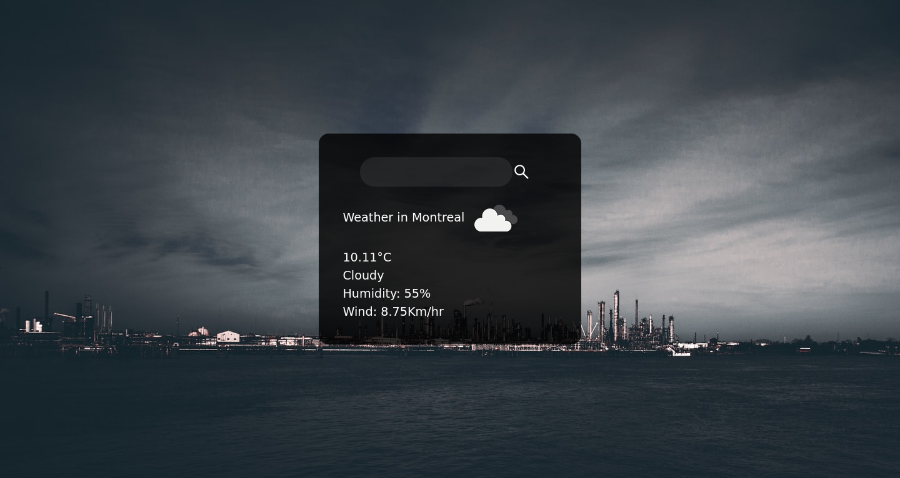

# weather-app
 


### Description
**weather-app** is a  small app that displays the weather data of the world's major cities through a search bar using [openweathermap](https://openweathermap.org/api) API. 

### content 

```sh
.
├── index.html
├── README.md
├── script.js
└── style.css
```
### reference 

* [Openweathermap API](https://openweathermap.org/api) - source of the data (get API key)

* [REST-API Call](https://levelup.gitconnected.com/all-possible-ways-of-making-an-api-call-in-plain-javascript-c0dee3c11b8b) - Learn how to call API in javascript 

### Author 
* Saliou ([seasayDev](https://github.com/seasayDev))

#### Licence
* The MIT Licence - [Link](LICENCE)